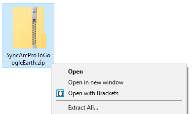
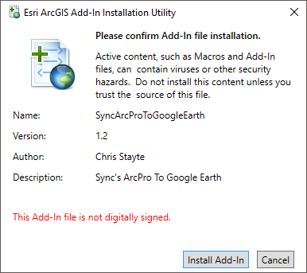

# ArcPro To GoogleEarth

Sync ArcGIS Pro's Camera To Google Earth Actively.

### Setup Instructions
| Step | Image |
| ---- | ----- |
| Download and Unzip the 'esri.addinX' file |  |
| Install the 'esri.addinX' file |  |
| Next is to configure Google Earth  Open Google Earth and go to Tools -> Options  Then go to the Navigation Tab  Change the Fly-To Speed to 5  *This only need to be done once per user / per machine | |
| You can find the tool on the 'Addin' tab in ArcGIS Pro |  |

### Download
- **ArcGIS Pro V1.4 - [Link](https://github.com/ChrisStayte/ArcPro_To_GoogleEarth/releases/download/v1.2/SyncArcProToGoogleEarth.zip)**

### License

The MIT License (MIT)

Copyright (c) 2016 Chris Stayte

Permission is hereby granted, free of charge, to any person obtaining a copy
of this software and associated documentation files (the "Software"), to deal
in the Software without restriction, including without limitation the rights
to use, copy, modify, merge, publish, distribute, sublicense, and/or sell
copies of the Software, and to permit persons to whom the Software is
furnished to do so, subject to the following conditions:

The above copyright notice and this permission notice shall be included in all
copies or substantial portions of the Software.

THE SOFTWARE IS PROVIDED "AS IS", WITHOUT WARRANTY OF ANY KIND, EXPRESS OR
IMPLIED, INCLUDING BUT NOT LIMITED TO THE WARRANTIES OF MERCHANTABILITY,
FITNESS FOR A PARTICULAR PURPOSE AND NONINFRINGEMENT. IN NO EVENT SHALL THE
AUTHORS OR COPYRIGHT HOLDERS BE LIABLE FOR ANY CLAIM, DAMAGES OR OTHER
LIABILITY, WHETHER IN AN ACTION OF CONTRACT, TORT OR OTHERWISE, ARISING FROM,
OUT OF OR IN CONNECTION WITH THE SOFTWARE OR THE USE OR OTHER DEALINGS IN THE
SOFTWARE.
